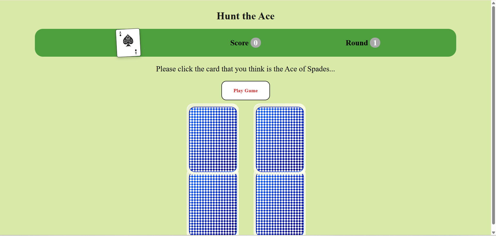
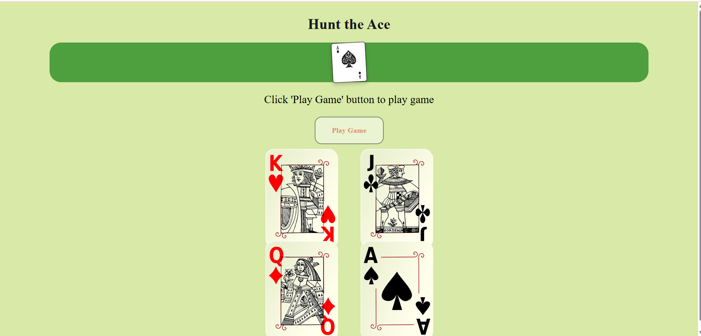

# 🃏 Hunt the Ace Game

## 📌 Description
**Hunt the Ace** is a fun and simple card game where players try to find the **Ace of Spades** among shuffled cards. Built using **HTML**, **CSS**, and **JavaScript**, this game is interactive and engaging!

## 🔍 Preview

### 🎮 Gameplay Screenshot

### 🧩 Start Screen

## ✨ Features
- 🔄 Interactive card flipping and shuffling animations  
- 🧠 Game scoring based on rounds and correct card choices  
- 📱 Responsive design for all screen sizes  
- 💾 Save and resume progress using local storage  

## 🌐 Access the Game Online
Click the link below to play the game in your browser:  
🔗 [Live Link to Hunt the Ace](https://a-arti.github.io/Card--game/)

## 🕹️ How to Play
1. Click the **"Play Game"** button to start.
2. Watch the cards shuffle, then pick the one you think is the **Ace of Spades**.
3. ✅ Score points for correct guesses.
4. 🏁 The game ends after a fixed number of rounds.

## 🛠️ Technologies Used
- ⚙️ **HTML**
- 🎨 **CSS** (Flexbox & Media Queries)
- 🧠 **JavaScript** (DOM manipulation, animations)

---

